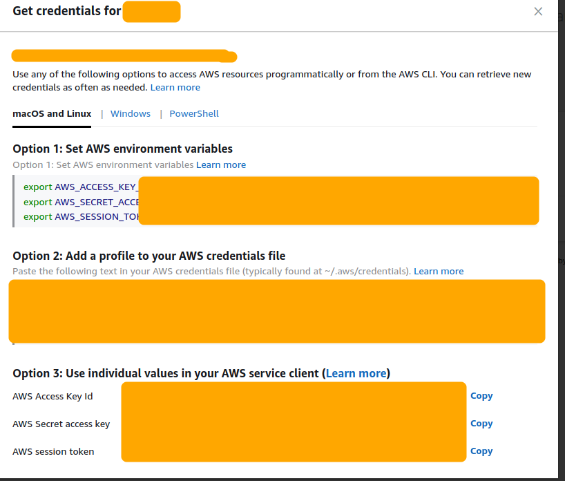
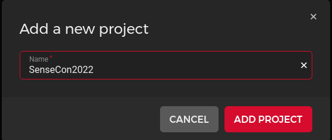

# SenseCon2022-IaC-Ansible-Workshop

## Setup 

Clone this repository on the machine you intend to follow the workshop from. I recommend setting up a clean Ubuntu VM and running this [playbook](https://github.com/justin-p/ansible-playbook-terraform-workstation#installation) in your VM.

```
git clone https://github.com/justin-p/SenseCon2022-IaC-Ansible-Workshop
```

### Create free AWS account

Open https://aws.amazon.com/free and click on `Create a Free Account`.


Enter a valid `Root user e-mail address`, a `AWS account name` and click on `Verify email address`/


Verify the e-mail address. You should receive a code on your e-mail. Enter the code on this page and click on `Verify`.


Setup a password for the root user, then click on `Continue (step 1 of 5)`


Click on Personal and fill in your personal information,then click on `Continue (step 2 of 5)`


Fill in your credit card information, then click on `Continue (step 3 of 5)`. The next steps depend on your credit card. You are on your own on this part.


Fill in a valid phone number to valide the account, then click then click on `Send SMS (step 4 of 5)`.


Enter the validation code then click on `Continue (step 4 of 5)`


Select `Basic support - Free` and click on `Complate sign up`.


Now click on `Go to the AWS Management Console` and login to your new account.


Login to the account using the root user.


### Tokens

#### AWS free account (root user)

**NOTE**: It is not recommended to generate API keys for the root account. Since this is a workshop we will ignore this best practice to save on time.

Login into your AWS account and click on your username and then `Security credentials`.


Click on `Access keys (access key ID and secret access key)`, then click on `Generate New Access Key`.


Copy the `Access Key ID` and the `Secret Access Key`


Replace `AAABBBCCC` in the commands below with the generated ID and Key and run these commands in your terminal. This will ensure that Terraform can authenticate.

```
export AWS_ACCESS_KEY_ID="AAABBBCCC"
export AWS_SECRET_ACCESS_KEY="AAABBBCCC"
```

#### AWS federated

If you have access to AWS through SSO/federated users the setup is easier. During the login you will be prompted to select a role. Here you can click on `Command line or programmatic access`.


Then copy `Option 1` and run this in your terminal. This will ensure that Terraform can authenticate.



```
export AWS_ACCESS_KEY_ID="AAABBBCCC"
export AWS_SECRET_ACCESS_KEY="AAABBBCCC"
export AWS_SESSION_TOKEN="AAABBBCCC"
```

#### DigitalOcean

Login into your account and click on `API`.


Click on `Tokens/Keys` and on `Generate New Token`.


Give the token a name (ex.: `SenseCon2022`), set the desired expiration, ensure `Write` is enabled and click on `Generate Token`.


Copy this token.


Replace `dop_v1_AAABBBCCC` with your token in the command below and then run this command in your terminal. This will ensure that Terraform can authenticate.

```
export DO_PAT="dop_v1_AAABBBCCC"
```

#### Hetzner

Login into your account and click on `New Project`.


Give a name to this new project (ex.: `SenseCon2022`).



Open the new project.


Click on `Security`.


Click on `API Tokens` and then `Generate API Token`.


Give the token a name (ex.: `SenseCon2022`), ensure `Read & Write` is checked and click on `Generate API Token`.


Copy this token.


Replace `AAABBBCCC` with your token in the command below and then run this command in your terminal. This will ensure that Terraform can authenticate.

```
export HCLOUD_TOKEN="AAABBBCCC"
```

### Variables

#### `deploy_server/defaults/main.yml`

Change the variables in this file, below is a description of the variables.

`provider` - your preferred provider. Can be `aws`, `digitalocean` or `hetzner`  

`project_name` - project name. you can leave this on the default, `sensecon2022`  

`sshkey_folder` - your .ssh folder location. Must be full path like `/home/justin/.ssh`  


## Create infrastructure

To create the infrastructure change directory to `deploy_server` and run the ansible create playbook.

```
cd deploy_server
ansible-playbook create.yml
```

## Destroy infrastructure

To create the infrastructure change directory to `deploy_server` and run the ansible destroy playbook.

```
cd deploy_server
ansible-playbook destroy.yml
```
